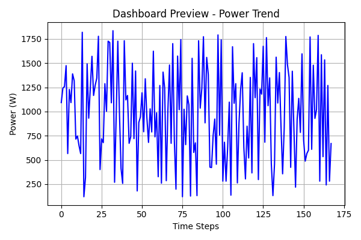
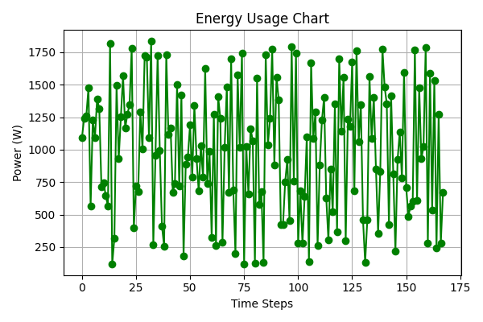
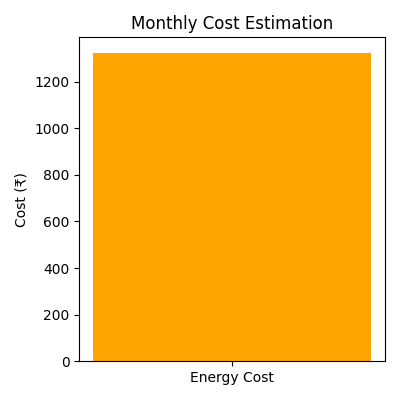
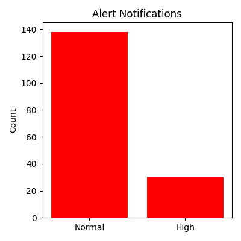
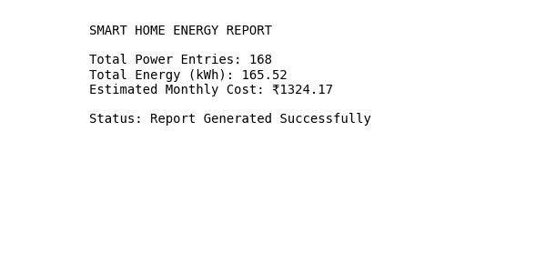

# ⚡ Smart Home Energy Monitoring System

An IoT-based Smart Home Energy Monitoring System that monitors electricity usage, estimates energy cost, detects abnormal power consumption, and generates analytical reports with visualizations.

---

## 📌 Project Overview

This project simulates a smart energy monitoring system using **Arduino for data simulation** and **Python for data processing, analysis, and visualization**. It helps users understand and optimize household energy consumption.

---

## 🚀 Features

- ⚡ Real-time energy data simulation (Arduino)
- 📊 Power consumption tracking and analysis
- 💰 Automatic electricity cost estimation
- 🚨 Alert system for high power usage
- 📈 Data visualization using graphs and charts
- 📄 Automated PDF report generation
- 🧾 CSV-based data logging and processing

---

## 🧠 Tech Stack

- Python
- Arduino (C++)
- Pandas
- NumPy
- Matplotlib
- ReportLab (PDF generation)

---

## 📁 Project Structure

Smart-Home-Energy-Monitoring-System/
│
├── arduino_code/
│   └── energy_monitor.ino
│
├── python_simulation/
│   ├── data_generator.py
│   ├── energy_calculator.py
│   ├── cost_estimator.py
│   ├── alert_system.py
│   ├── report_generator.py
│   └── visualizer.py
│
├── data/
│   ├── energy_data.csv
│   └── sample_energy_data.csv
│
├── outputs/
│   ├── energy_report.csv
│   └── monthly_report.pdf
│
├── images/
│   ├── dashboard_preview.png
│   ├── energy_usage_chart.png
│   ├── monthly_cost_chart.png
│   ├── alert_notification.png
│   └── pdf_report_preview.png
│
├── main.py
├── requirements.txt
├── README.md
├── LICENSE
└── .gitignore

---

## ⚙️ System Workflow

Arduino Simulation
↓
Data Generation (Python)
↓
Energy Calculation
↓
Cost Estimation
↓
Alert Detection
↓
Visualization + Reports

---

## 📊 Visual Outputs

### 📊 Dashboard Preview

### ⚡ Energy Usage Chart

### 💰 Monthly Cost Chart

### 🚨 Alert Notification

### 📑 PDF Report Preview

## 📈 Key Modules

### 🔹 Data Generator
Simulates real-time energy usage data.

### 🔹 Energy Calculator
Calculates total energy consumption in kWh.

### 🔹 Cost Estimator
Estimates electricity cost based on usage.

### 🔹 Alert System
Detects high power consumption events.

### 🔹 Visualizer
Generates charts for energy insights.

### 🔹 Report Generator
Creates structured PDF reports.

---

## 💡 Applications

- Smart homes
- Energy auditing systems
- IoT-based monitoring systems
- Electricity usage optimization
- Educational IoT projects

---

## 🏆 Project Highlights

- Fully modular architecture
- Real-world IoT simulation
- Automated analytics pipeline
- Professional report generation
- Clean visualization system

---

## 📌 Future Improvements

- Real-time cloud integration (IoT dashboard)
- Live sensor integration
- Mobile application interface
- AI-based energy prediction
- Web dashboard using Streamlit

---

## 👩‍💻 Author

**Ananya Jain**  

---

## 📜 License

This project is licensed under the MIT License.
